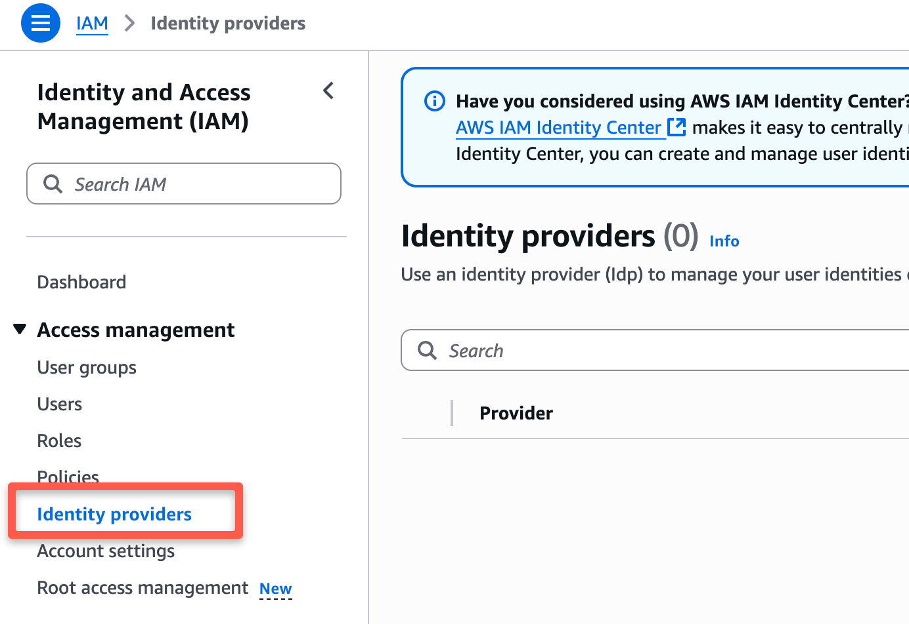

# How to setup OIDC connection with Github Repository?

To setup the OIDC connection, follow the below steps:

#### Step 1: Create the OIDC Identity Provider in AWS IAM for GitHub 

Navigate to AWS IAM → Identity Providers

<figure><figcaption></figcaption></figure>

Add a new provider:

* **Provider type:** OpenID Connect
* **Provider URL:**`https://token.actions.githubusercontent.com`
* **Audience:**`sts.amazonaws.com`&#x20;

<figure><figcaption></figcaption></figure>

#### Step 2: Create WebIdentity IAM Role with Trust Policy 

If you **click the created Identity provider**, you will get an option to **Assign role** as shown below.

<figure><figcaption></figcaption></figure>

Click **Assign role** and select the create a new role option.

Next, select the trusted entity type "**Web Identity**" to log in to AWS with OIDC.

<figure><figcaption></figcaption></figure>

Next, add IAM permissions. Here, I am adding admin permissions. But as per your requirements and use cases, you can add only the required IAM permissions that your runner needs.

<figure><figcaption></figcaption></figure>

Attach below permissions:

1. [AmazonEC2FullAccess](https://us-east-1.console.aws.amazon.com/iam/home?region=us-east-1#/policies/details/arn%3Aaws%3Aiam%3A%3Aaws%3Apolicy%2FAmazonEC2FullAccess)
2. [AmazonS3FullAccess](https://us-east-1.console.aws.amazon.com/iam/home?region=us-east-1#/policies/details/arn%3Aaws%3Aiam%3A%3Aaws%3Apolicy%2FAmazonS3FullAccess)
3. [IAMFullAccess](https://us-east-1.console.aws.amazon.com/iam/home?region=us-east-1#/policies/details/arn%3Aaws%3Aiam%3A%3Aaws%3Apolicy%2FIAMFullAccess)

> This is the IAM Role that your GitHub Actions workflow can assume. It definines what the workflow is allowed to do in your AWS account

